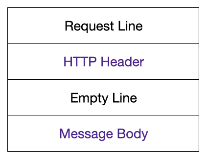
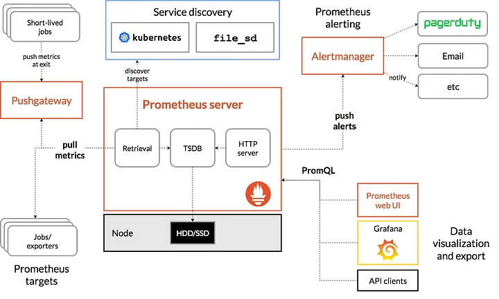
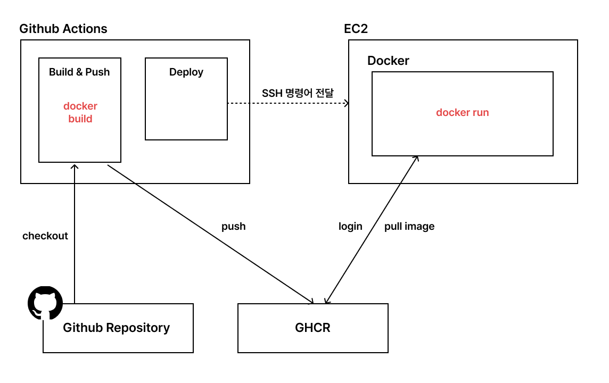

## 날짜: 2024-12-09

### 스크럼
- 학습 목표 1 : Docker multi stage build 차이와 빌드 구분 기준

### 새로 배운 내용
#### 주제 1: Docker Multi Stage Build 개념
- 빌드 등에는 필요하지만 최종 컨테이너 이미지에는 필요 없는 환경을 제거할 수 있도록 단계를 나누어서 이미지를 만드는 방법

#### 주제 2: Stage 구분 기준
- yarn install : 의존성 설치에 필요한 정보인 yarn.lock은 설치 이후에는 필요하지 않음

- yarn build : 
    - .next는 빌드 결과물, 빌드 결과물만 필요하고 기존 소스코드는 필요하지 않음
    - public/ 디렉토리 안의 파일들은 빌드 과정에서 .next로 복사되지 않고, 원본 경로 그대로 사용 → copy 필요
    - package.json은 왜 필요한가?
        - 런타임 의존성 관리 + 스크립트 실행 정의(yarn start)

- 나머지 개발 환경에서 필요한 설정 파일들 제외(gitConfig 등)

#### 주제 3: 실제 이미지 생성된 크기 확인


💥 이미지 크기 차이 확인 가능

✅ 멀티 스테이지 빌드 사용 안했을 때 폴더 구조


✅ 멀티 스테이지 빌드 사용했을 때 폴더 구조



### 오늘의 도전 과제와 해결 방법
- 도전 과제 1: typescript 기반 멀티 스테이지 구현
    javascript는 build가 필요하지 않아서 멀티 스테이지 구현을 위해서 typescript 기반 express 서버를 기준으로 멀티 스테이지 구현 진행
```docker
    # 1단계: 빌드 환경
    FROM node:18 AS builder
    WORKDIR /app
    COPY package.json package-lock.json ./
    RUN yarn install
    COPY . .
    RUN npm run build

    # 2단계: 실행 환경
    FROM node:18-slim
    WORKDIR /app
    COPY --from=builder /app/dist ./dist
    COPY --from=builder /app/public ./public

    EXPOSE 3000
    CMD ["node", "dist/app.js"]
```

### 오늘의 회고
- Docker 명령어에 대해서 잘못 알고 있던 부분도 정정하고, 새로운 멀티 스테이지 빌드 자체에 대해서 알게 되어 좋았다. 직접 여러 번 다른 프로젝트 적용에 실습해보며 어떤 식으로 스테이지 단계를 쪼개야하는지 느낄 수 있었다. 

### 참고 자료 및 링크
