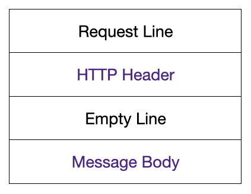

## 날짜: 2024-12-11

### 스크럼
- 학습 목표 1 : Test Containers에 대한 이해
- 학습 목표 2 : GitOps 등장 배경

### 새로 배운 내용
#### 주제 1: Test Containers에 대한 이해
- 테스트 환경에서 컨테이너화된 서비스를 사용하여 실제 환경 시뮬레이션, 테스트 실행할 때 필요한 다양한 서비스 자동 실행
- 컨테이너 기반의 테스트를 효율적으로 관리 및 실행
=> 테스트에 필요한 외부 시스템(ex. 데이터베이스, 메시징큐, 웹 서버)을 Docker 컨테이너로 쉽게 구성 가능


#### 주제 2: GitOps 등장 배경
- DevOps의 확장된 버전, Git을 중심으로 모든 배포 및 운영 과정을 관리 => 운영과 배포 레포지토리로 구분하여 관리함
- 배포 환경을 선언형으로 다루기 위한 CD의 분리
- 절차형으로 선언하는 경우, 개발자가 직접 워크플로우의 순서를 지정해주어야 했지만, 선언형의 경우에는 배포 최종 상태를 기술하면 Git을 통해 변경 사항을 추적하고, 해당 상태에 맞게 자동 배포 진행
- IaC의 연장선(Infrastructure as Code), 인프라를 코드로 정의하여 인프라를 자동화하고 관리하는 방식. 
    -> 클라우드 인프라를 선언하는 테라폼도 예시가 됨
    -> 배포와 운영에도 IaC를 적용한 것
- 해당 기술의 장점은 버전 관리를 코드로 진행하기 때문에 변경 이력 관리와 롤백, 감사 등이 편리하다는 점이 있음.

### 오늘의 도전 과제와 해결 방법
- 도전 과제 1: Multipart Boundary 관련 에러
```Error: Multipart: Boundary not found```
    - Fetch API를 활용해 Multipart/form-data를 전송할 때 직접 Content-type을 지정해서는 안된다고 함
    - 브라우저가 자동으로 바운더리를 생성하고 설정하기 때문에 직접 설정하면 에러가 발생
    - 관련 MDN 문서를 살펴보면 직접 지정시 브라우저가 바운더리를 설정하는 과정을 못하게 하게 되므로 문제가 되는 것
    ```
    Warning: When using FormData to submit POST requests using XMLHttpRequest or the Fetch API with the multipart/form-data content type
    (e.g. when uploading files and blobs to the server), do not explicitly set the Content-Type header on the request. 
    Doing so will prevent the browser from being able to set the Content-Type header with the boundary expression 
    it will use to delimit form fields in the request body.
    ```

    #### multipart/form-data에 대한 이해
    
    message body에 들어가는 데이터 타입을 명시해줄 때 사용하는 필드 Content-type

    [ Multipart 메세지 ]
    - 서로 붙어있는 여러 개의 메세지를 포함하여 하나의 복합 메세지로 전송
    - 바운더리 파라미터를 포함
    -> 바운더리는 메세지 파트를 구분하는 역할, 메세지의 시작과 끝 부분도 나타냄
    -> 메세지 파트라 함은 바디에 담아보내는 하나의 키를 기준으로 나뉜다고 생각하면 됨
    - 

### 오늘의 회고
- 오늘은 집중력이 좋았다. 근데 밥먹고 바로 앉기가 힘들다. 앉아도 딴짓하게 되는 듯... 이 시간을 어떻게 줄여야할지 고민해나가려고 한다. 

### 참고 자료 및 링크
[에러 관련 MDN 문서] : https://developer.mozilla.org/en-US/docs/Web/API/XMLHttpRequest_API/Using_FormData_Objects