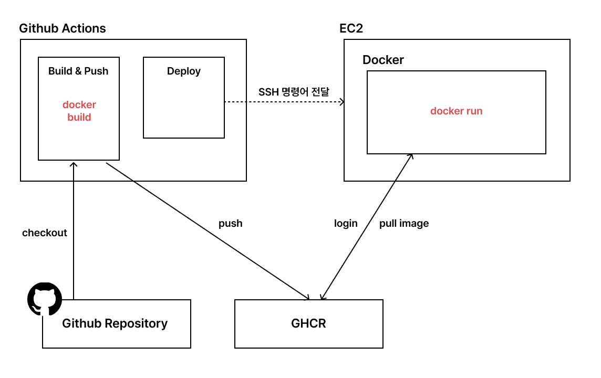

## 날짜: 2024-12-20

### 스크럼
- 학습 목표 1 : Github-actions
- 학습 목표 2 : Docker compose
- 학습 목표 3 : Kubernetes

### 새로 배운 내용
#### 주제 1: Github-actions
- Github에서 제공하는 CI/CD를 위한 도구
코드 변경시 이를 감지하여 테스트 자동 실행, 빌드, 배포 자동화 가능

dev + ops를 지원하는 도구

하나의 워크플로우 내부에 모든 작업 흐름을 정의하게 되고, 어떤 이벤트에 따라 해당 워크플로우가 수행될지 결정할 수 있다.

보통 이벤트는 push, 혹은 수동으로 설정 등 다양하게 설정 가능하다.

워크 플로우 내부에서는 Job 단위로 작업이 실행되는데, 의존성에 따라 순서대로 실행되게 하거나 병렬로 처리될 수 있도록 한다.

Job 내부에서도 스텝이라는 세부 작업 단위로 실행된다.

이 과정에서 action을 자주 활용하게 되는데, 이는 Github Actions에서 모듈처럼 제공하는 재사용 가능한 단위이다.

깃허브 checkout이 필요할 때 해당 과정에 필요한 모든 명령어를 적어줄 필요없이 actions/checkout을 활용하면 되는 것!

그리고 Github Actions를 사용하기 좋은 이유는 내부에 자체 서버를 제공해주고, 이러한 워크플로우의 작업을 진행해주기 때문이다. 젠킨스와 같은 다른 CI/CD 도구는 해당 워크플로우를 실행하기 위한 서버를 직접 생성해야만 한다.

그러나 Github Actions는 물리 서버 위에 있는 Runner를 활용해 각 Job을 올려 실행시켜준다. 

사용자는 워크플로우의 과정에만 집중할 수 있기에 큰 장점을 가진다.

아래는 Github Actions와 ghcr, docker를 활용한 CI/CD 구조도이다.

1. Build&Push Job 과정에서는 해당 워크플로우의 과정을 실행하는 깃허브 레포지토리에서 코드를 가져온다.
2. Github Actions 서버 내부에서 코드에 있는 dockerfile을 활용하여 docker 이미지를 빌드한다.
3. 이후 GHCR에 해당 이미지를 push한다.
4. Deploy 과정에서는 해당 코드를 올리고자 하는 EC2 서버에 SSH를 이용하여 명령을 전달한다.
5. SSH를 이용해서 GHCR에 login하고 이미지를 EC2 서버에 Pull한다. 
6. Pull 과정이 실행된 이미지를 기반으로 Docker run을 통해 실행한다
7. 어떤 코드가 업데이트 될 때마다 해당 과정을 수행하여 빠르게 배포될 수 있도록 할 수 있다.

#### 주제 2: Docker compose
Docker-Compose는 하나의 서비스를 운영하기 위해 실행시켜야하는 컨테이너가 여러 개일때 활용하는 방식이다.

여러 컨테이너를 하나로 조합해서 사용할 수 있으며, 여러 개의 컨테이너를 한번에 빌드하거나 작동시킬 수 있다.

이를 구성하는 파일은 `docker-compose.yml` 파일이고, 실행시키기 위해서는 `docker compose up` 을 통해서 가능하다

만약 순서대로 만들어져야 하는 컨테이너가 있다면 depends on 옵션을 활용할 수 있다.

#### 주제 3: Kubernetes
Docker-swarm처럼 여러 개의 컨테이너를 동시에 관리할 수 있는 오케스트레이션 도구이다.

이는 세 가지 철학을 기반으로 만들어졌는데, 다음과 같다.

1. Immutable Infrastructure
- 자원을 수정하지 않는다.
- 사용하지 않는 자원이 있다면 제거하고, 변경하고 싶다면 기존의 자원을 삭제한 뒤 새로운 환경을 만든다.
- `kubectl set image deployment/deploy-name image-name=새로운 이미지명`
    - 이와 같은 명령어로 실행되고 있는 deployment의 자원의 설정을 바꿀 수 있다.
    - 정확하게 이야기하면 내부에서는 바꾸는 것이 아니라, 기존 자원을 차례대로 삭제하고 새로운 이미지명을 세팅된 자원을 하나씩 생성하는 것이다.
    - 롤링 업데이트 방식으로 진행된다.
2. Declarative Configuration
- 자원을 선언형으로 관리한다.
- 원하는 상태를 만들기 위해 절차적으로 명령어를 수행하는 것이 아니라 선언을 하면, 해당 상태를 만들기 위해서 쿠버네티스가 최선을 다한다.
- 만약 서버가 안뜨더라도 상태를 만들기 위해 끊임없이 restart 하는 것을 확인할 수 있다.
- `kubectl edit deployment deploy-name`
    - 해당 명령어를 통해 리소스의 설정을 편집할 수 있고, 저장되면 해당 상태로 업데이트하기 위해 쿠버네티스가 최선을 다한다.
3. Self Healing
- 장애가 발생했을 때 사람의 개입을 최소화하여 자원을 자동으로 복구한다.
- 지속적으로 상태를 모니터링하여 yaml 파일에 명시된 상태와 다를 경우 자동으로 복구 과정을 실행한다.
- 파드를 강제 종료하더라도, deployment에 명시된 replicas의 수를 맞추기 위해서는 자동으로 복구 과정이 실행되는 것을 확인 가능

## Kubernetes 기본 구조

1. kubectl을 통해 명령어를 마스터 노드에 전달한다.
2. 마스터 노드에 전달된 명령어를 API Server가 명령어에 따라 상태 변화 조회나 상태 변경을 실행한다.
3. 이때 API 서버가 상태를 조회할 때, etcd 내부에 명시된 상태 데이터를 맞추기 위해서 어떤 작업을 수행할지 확인한다.
4. API 서버는 상태에 따라 어떤 작업을 수행할지 세부적으로 해당 대상을 결정하여 Controller-Manager에게 전달한다.
5. 이후 새로 생기는 파드가 있다면 API 서버가 스케쥴러에게 전달한다.
6. 스케쥴러는 파드를 특정 노드에 할당하는 과정을 실행한다.
7. 워커노드 내부에 있는 kubelet은 스케쥴러에 의해 전달받은 명령 사항을 실행한다.

### 오늘의 회고
- 쿠버네티스의 내부를 드디어 이해하게 됐다. hub and spoke 구조라는 걸 이해하니 전체적인 구조를 이해하는게 쉬워졌다. 지금까지 내부적으로 어떤 구조를 갖추고 있는지 이해하지 못하고 명령어를 쓰느라 헷갈렸던 부분이 있었는데 이제 이해가 된다. 그리고 맨날 yaml 파일 수정하고 다시 올리느라 힘들었는데 명령어에 수정 후 바로 적용되는게 있었다.. 역시 똑똑해야 몸이 편하다 

### 참고 자료 및 링크
https://tech.kakaopay.com/post/jack-k8s-internals-part-2/
쿠버네티스 내부 구조에 대해 비유적으로 잘 표현한 블로그글, 재밌게 읽었다.